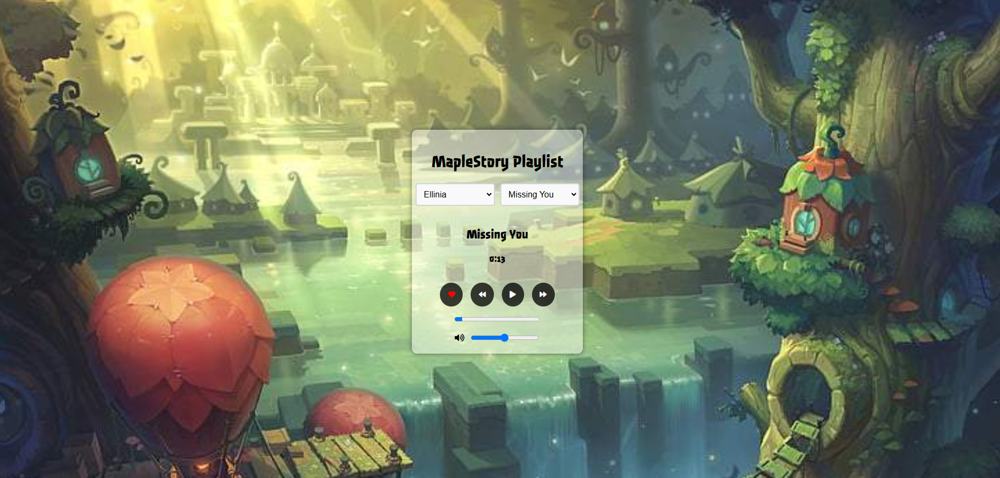
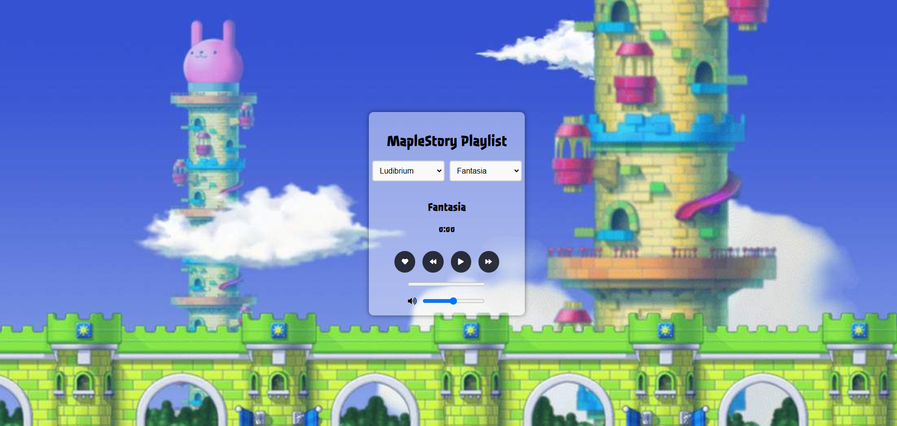

# MapleStory Playlist 🎵

A web application that allows users to explore and play iconic MapleStory background music categorized by maps. Users can dynamically change the background, navigate between songs, and save their favorites. The app includes an interactive UI with responsive audio controls.

## Features ✨

- **Dynamic Backgrounds**: Each map has a unique background image.
- **Playlist Navigation**: Select songs by map or view your liked songs.
- **Audio Playback Controls**: Play, pause, skip, and adjust volume seamlessly.
- **Like Songs**: Save your favorite tracks for quick access later.
- **Progress Tracking**: View and interact with the song progress bar.
- **Local Storage**: Remembers your liked songs and last-selected map.

## Demo 🎥
You can try the live application here: [MapleStory Playlist](https://pavelsav960.github.io/MS-BGM-Player/)

## Screenshots 📸

## Usage 📖

- Select a map from the dropdown to view its playlist.
- Use the playback controls to play, pause, skip, or adjust the volume.
- Like songs by clicking the heart icon. Access liked songs from the "Liked Songs" option.
- Watch the background change dynamically as you switch maps.

## Technologies Used 🛠️

- **HTML**: Markup for the app's structure.
- **CSS**: Styling for the user interface.
- **JavaScript**: Dynamic functionality and interactivity.

## Future Enhancements 🚀

- Add shuffle and repeat options.
- Implement mobile-friendly, responsive design.
- Include a search feature for songs.
- Enhance accessibility with keyboard shortcuts and ARIA labels.

